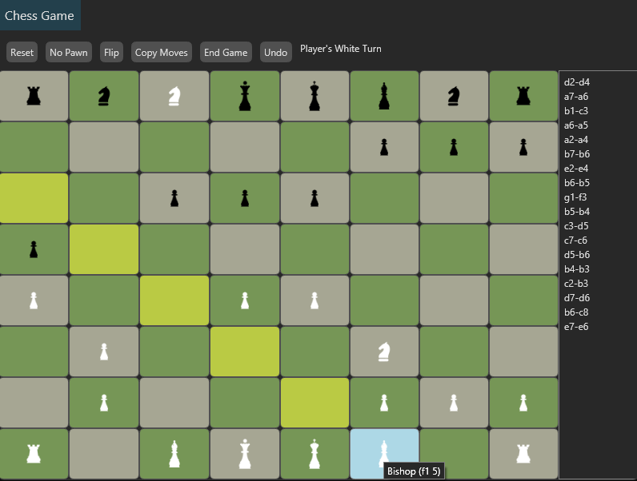

# FSharpChess

FSharpChess is a chess engine and GUI application written in F#. It features a modular chess logic library and a cross-platform Avalonia UI frontend.



## Features
- Chess engine with move validation and AI opponent
- Avalonia-based GUI for interactive play
- Modular design for easy extension
- Unit tests for core logic

## Projects
- **Chess**: Core chess logic and engine
- **Avalonia.Chess**: GUI frontend using Avalonia
- **Tests**: Unit tests for chess logic

## Getting Started

### Prerequisites
- [.NET 8 SDK](https://dotnet.microsoft.com/download)

### Build and Run
1. Clone the repository:
   ```sh
   git clone https://github.com/chrisevans9629/FSharpChess.git
   cd FSharpChess
   ```
2. Build the solution:
   ```sh
   dotnet build
   ```
3. Run the GUI application:
   ```sh
   dotnet run --project Avalonia.Chess/Avalonia.Chess.fsproj
   ```

### Running Tests
```sh
 dotnet test Tests/Tests.fsproj
```

## Usage
- Launch the GUI and start a new game
- Play against the AI or another human
- View move history and game status

## ChessPage and MVU Pattern

The `ChessPage.fs` file implements the main chess UI using the MVU (Model-View-Update) pattern via Avalonia.FuncUI:

- **Model (State):** Holds the current game state, including the board, moves, player turn, AI color, and UI highlights.
- **View:** Renders the chessboard, move list, control buttons, and game status. The view is a function of the current state.
- **Update:** Handles messages (user actions, AI moves, etc.) and produces a new state. All game logic and UI updates are managed here.

### MVU Flow in ChessPage
1. **State**: The `State` record contains all data needed for the UI and game logic.
2. **Msg**: The `Msg` union defines all possible actions (e.g., move piece, reset, undo, AI move).
3. **update**: The `update` function processes messages and returns a new state, optionally triggering commands (like AI moves).
4. **view**: The `view` function builds the UI based on the current state, including the chessboard, move history, and controls.

This pattern ensures a clear separation of concerns and makes the UI predictable and easy to maintain.

## Chess AI

The `ChessAi.fs` module implements the chess engine's AI opponent using a simplified minimax algorithm with alpha-beta pruning:

- **Board Evaluation:** The AI evaluates board positions using material values for each piece and a basic mobility score. Each piece type (King, Queen, Rook, Knight, Bishop, Pawn) is assigned a value, and the total score reflects both material and available moves.
- **Minimax Algorithm:** The `minimax` function recursively explores possible moves up to a fixed depth, alternating between maximizing and minimizing players. It uses alpha-beta pruning to skip branches that cannot improve the outcome, improving efficiency.
- **Move Selection:** The AI selects the move that leads to the best evaluated position for its color. The top-level `minimax2` function is called to choose the AI's move during gameplay.

This approach allows the AI to play reasonable moves and respond to the player's actions, while remaining efficient enough for interactive play.

## Chess Actions

The `ChessActions.fs` module contains the core logic for chess move generation, validation, and game state management:

- **Move Generation:** Functions for each piece type (pawn, knight, bishop, rook, queen, king) generate all possible moves according to chess rules, including special logic for pawn movement and king safety.
- **Move Validation:** Ensures moves are legal, including checks for piece color, board boundaries, and king safety (prevents moves that leave the king in check).
- **Game State Updates:** The `moveById` function applies moves to the board, updating piece positions and tracking piece movement history.
- **Endgame Detection:** Determines if the game is over by checking for checkmate, stalemate, or tie conditions using the `gameOver` function.
- **Utilities:** Includes helper functions for board indexing, enemy detection, and move pruning to ensure only valid moves are presented.

This module is essential for enforcing chess rules and maintaining a valid game state throughout play.

## Acknowledgements
- [Avalonia UI](https://avaloniaui.net/) for cross-platform GUI
- F# community for language and library support
